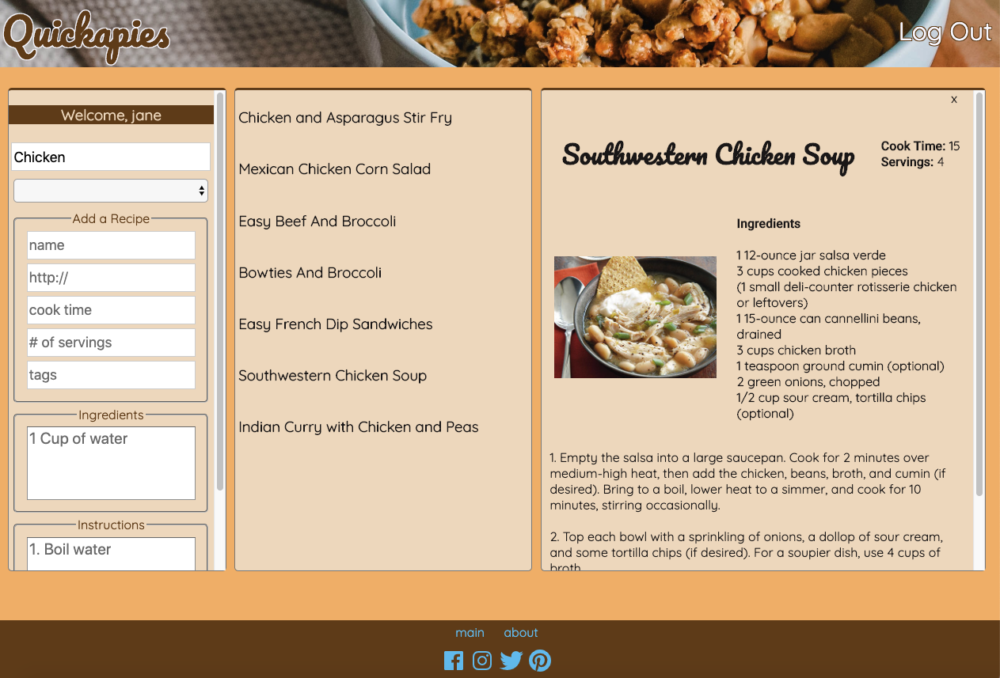

# Quickapies
> create, search, and sort through a collection of quick recipes

## Table Of Contents
* [Introduction](#introduction)
* [Collaborators](#collaborators)
* [Live Link](#live-link)
* [Technologies](#technologies)
* [Dependencies](#dependencies)
* [User Stories](#user-stories)
* [Unsolved Problems](#unsolved-problems)
* [Project Status](#project-status)
* [References](#references)

## Introduction

Quickapies is a recipe app which allows a user to search through a database of recipes that take less than 30 minutes of total time to prepare. We decided to develop Quickapies for people who don't have much time to cook or prepare meals, but would like access to a variety of recipes that fit into any busy schedule.

## Collaborators
* Becka Catanzaro
* Yulli Chong
* Carramah Quiett

## Live Link
https://quickapies.herokuapp.com/

## Technologies
* HTML / CSS
* JavaScript
* AngularJS
* MongoDB
* Git/Github
* Heroku

## Dependencies
* bcrypt v.3.0.6
* dotenv v.8.0.0
* express v.4.17.1
* express-session v.1.16.2
* mongoose v.5.6.9

## User Stories
* As a user, I do not have to be logged into to access the recipe database, and I can filter my search using keywords in the search bar.
* As a user, I can create a username and password.
* As a user, when I am logged in, I can add new recipes to the database.
* As a user, when I am logged in, I can edit or delete my own recipes.
* As a user, when I am logged in, I can "like" or "dislike" any recipe in the database, and my likes and dislikes are visibly tallied with other users.
* As a user, when I adjust the size of my screen or use my phone, the app is responsive and its content is easy to read.

## Unsolved Problems

### Adding a free API which allows the user to search through a wider base of recipes.
* None of the free APIs had instructions available to display on our app; all of them simply gave a link to redirect the user to a different website where the instructions were available.
* Goal: Find a free API with access to all information needed to make a recipe card on the app.

### Ability to Like/Dislike a recipe.
* Right now, when a users likes or dislikes a recipe, the all like/dislike options are removed from their scope.
* Goal: When a user who has already clicked "like" or "dislike" clicks on the "like" or "dislike" button, their vote will then be removed and they will be able to cast it again.

### User Log In
* Improve log in system so that attempting to log in with a username and password that do not match, the user is presented with some sort of notification.
* Improve log in system so that a user attempting to create a username that has already been taken will receive some sort of notification.

## Project Status
This project is currently complete, but may be revisited at a later date.

## References
* GA Notes
* BULLDOGJOB: https://bulldogjob.com/news/449-how-to-write-a-good-readme-for-your-github-project
* Plunker: http://plnkr.co/edit/XklvXtc1AZpndjLvXrh8?p=preview
